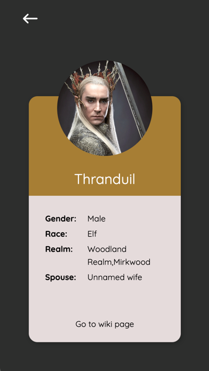

## Inleiding
Voor de eindopdracht Frontend van Novi school heb ik een app ontwikkeld die informatie ophaalt over de boeken en films van Lord of the Rings. Ik ben dol op de Lord of the Rings boeken en films. Maar ik vergeet altijd wie wie ook alweer is. Daarom heb ik deze applicatie ontwikkeld waarin je informatie kan opvragen over de karakters en waarmee je kan oefenen wie wie is. Hiervoor heb ik gebruik gemaakt van [The One Api](https://the-one-api.dev/) die ik in een werkende en gestylde applicatie heb verwerkt.
De applicatie is in eerste instantie gestyled voor smartphones, maar op grotere schermen werkt het ook. Veel plezier!

Het project is opgezet met [Create React App](https://github.com/facebook/create-react-app).

## Benodigdheden
Om de informatie van The One API te krijgen, heb je een API key nodig. Deze kun je op hun website krijgen: https://the-one-api.dev/ en in de code te plaatsen op de plek van ${process.env.REACT_APP_LOTR_API_KEY}. Dit staat op meerdere pagina's.

## De applicatie starten
Als je het project gecloned hebt naar jouw locale machine, installeer je eerst de node_modules door het volgende commando in de terminal te runnen:

`npm install`

Wanneer dit klaar is, kun je de applicatie starten met behulp van:

`npm start`

of gebruik de WebStorm knop (npm start). Open http://localhost:3000 om de pagina in de browser te bekijken.

Install axios?

## Inloggen

Voor het opslaan van de gebruikersgegevens, is gebruik gemaakt van de [NOVI Educational Backend](https://github.com/hogeschoolnovi/novi-educational-backend-documentation/blob/main/README.md#0-test). Hier is geen API key voor nodig. 
Dit is alleen bedoeld voor opleidings-doeleinden, daarom wordt de database met gebruikers vaak binnen één uur weer geleegd en kan het zijn dat je opnieuw een account moet aanmaken.

